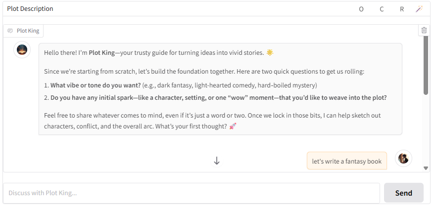
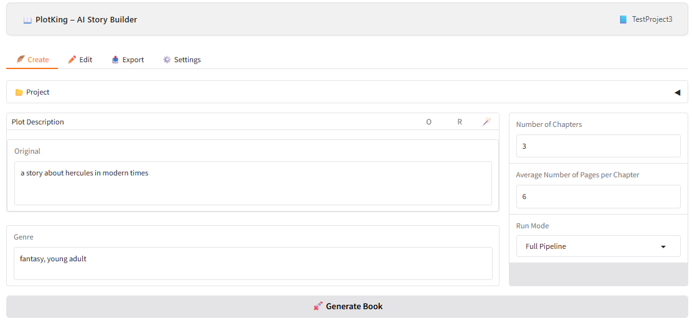
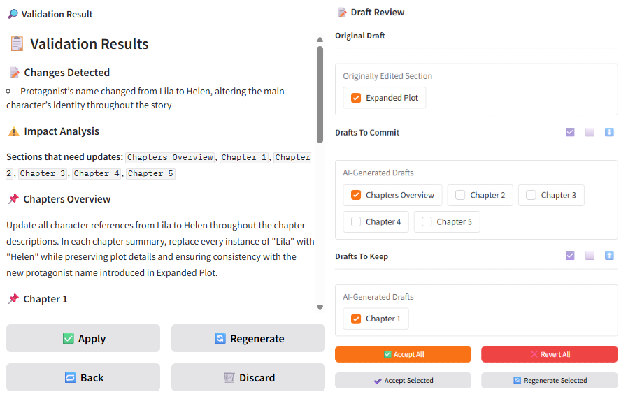
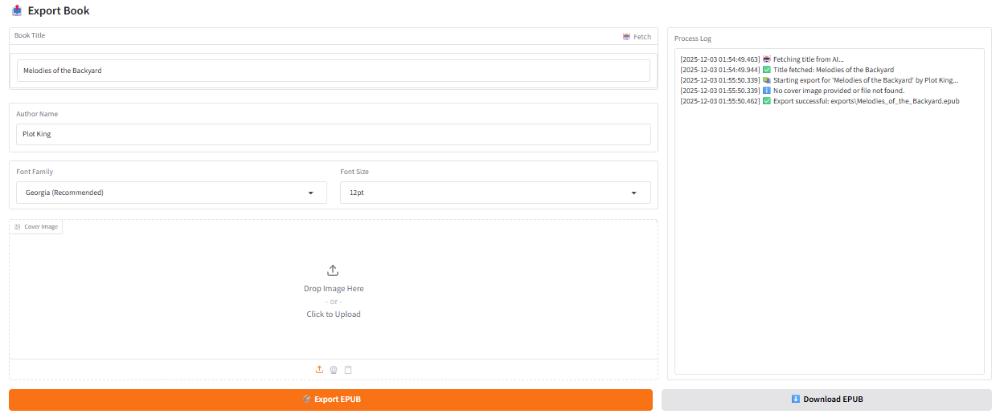

**The code in this repository is proudly and entirely written using AI**

# PlotKing - AI Story Builder

PlotKing is an interactive **AI Book Generator** that helps writers generate, validate, refine, and export novels. The application takes a short plot description and transforms it into a complete book using local or cloud LLM deployments.


## 🚀 How It Works (General Flow)

PlotKing follows a structured pipeline to ensure high-quality output:

1.  **Refine**: You define the core idea, genre, and structure. You can refine this manually, use AI refine to automatically expand and enhance your plot, or have a conversation with Plot King AI to brainstorm and detail your story concept.
2.  **Create**: Using the refined input from the previous step, the AI expands this into a detailed plot, chapter overview, and full chapters.
3.  **Edit**: You review the generated content. You can rewrite sections with AI, chat with the AI for suggestions, or manually edit text. The unique **Validation System** ensures your changes don't break the story's continuity.
4.  **Export**: Once satisfied, you export your novel to a formatted EPUB file, ready for reading or publishing.

---

## ✨ Key Features

### 1. Refine: Shape Your Story Concept

Before creating your book, refine your story idea through multiple approaches:
-   **Manual Input**: Directly write and edit your plot description, genre, and structure.
-   **AI Refine**: Use the AI refine button to automatically expand and enhance your plot with creative details, proper structure, and genre-appropriate elements.
-   **Chat with Plot King**: Have a conversation with Plot King AI to brainstorm ideas, discuss characters, settings, conflicts, and narrative details. The AI helps you explore different aspects of your story and fills in gaps.

### 2. Create: From Idea to Structure

The creation process uses your refined input and is broken down into logical steps to maintain coherence:
-   **Plot Expansion**: Turn your refined idea into a rich, multi-paragraph synopsis.
-   **Chapter Outline**: The system generates an outline of chapters based on the expanded plot.
-   **Full Generation**: Each chapter is written individually, with the AI referencing the plot and previous chapters to maintain context.
-   **Automatic Validation**: After generating a chapter, a separate AI agent reads it to ensure it matches the outline. If it fails, it auto-regenerates until it passes.

### 3. Edit: Advanced AI-Assisted Writing

The Editor tab is where the magic happens. It's not just a text box; it's a suite of tools:

#### 🛠️ Editing Modes
-   **View**: Read-only mode to browse your story and manage drafts.
-   **Manual**: Standard text editor for direct changes.
-   **Rewrite**: Select text and give instructions (e.g., "Make this dialogue more intense", "Describe the setting in more detail").
-   **Chat**: Converse with "Plot King" to brainstorm ideas or request changes for the current section.

Instead of saving changes directly to your story, you can choose to save them as **user drafts**. This allows you to continue editing across different modes, refining your work until you're satisfied. You can validate and apply your changes to the final story only when you're ready.

#### 🛡️ Validation System & Generated Drafts
 

When you make changes that impact subsequent sections, PlotKing automatically generates **drafts** for those affected sections.
-   **Impact Analysis**: The system analyzes how your change affects future chapters.
-   **Auto-Generated Drafts**: If your change alters the plot significantly, the AI automatically creates draft updates for subsequent chapters to maintain continuity.
-   **Draft Review**: You can compare the **Checkpoint** (original) vs. **Draft** (new) using the **comparison view** ⚖️.
-   **Selective Apply**: You choose which AI suggestions to keep and which to discard or regenerate.

### 4. Export: Publish Ready

Turn your project into a finished product:
-   **EPUB Generation**: Creates a professional e-book file compatible with most readers.
-   **Metadata Fetching**: AI can suggest a title based on your story content.
-   **Customization**: Choose fonts (Georgia, Palatino, etc.) and set font sizes for the output file.
-   **Cover Art**: Upload a custom cover image or **generate** one using AI, to be embedded in the EPUB.

### 5. Project Management
Save, load, create, and delete story projects.

### 6. Settings: Configurable Models & Task Assignments
-   **Models**: Support for multiple providers (LM Studio, OpenAI, Gemini, xAI for LLM tasks; Automatic1111 and OpenAI for image generation) with configurable local endpoints, API keys, and provider-specific settings.
-   **Tasks**: Assign different models to specific tasks for optimal performance and easy switching.

---

## Requirements

The application requires:
-   Python 3.6+
-   Gradio for the UI
-   Access to an LLM API (default: `http://localhost:1234/v1/chat/completions` for local deployments, but configurable)
-   Additional dependencies listed in `requirements.txt`

## Getting Started

1.  Install dependencies: `pip install -r requirements.txt`
2.  Run the application: `python main.py` or `./run.bat` on Windows.
3.  Access the UI through your browser at `http://localhost:7860`

## Running a Local LLM with LM Studio

PlotKing is designed to work seamlessly with **local LLM deployments**, and **[LM Studio](https://lmstudio.ai/)** provides an easy way to run models locally without internet dependency.

### 🔹 Step 1: Install LM Studio
1.  Download and install LM Studio for your operating system:
    👉 [https://lmstudio.ai/](https://lmstudio.ai/)
2.  Launch LM Studio after installation.

### 🔹 Step 2: Load a Local Model
1.  Open the **Models** tab in LM Studio.
2.  Search for and download a model suitable for long context and creative writing. For local development, I'm using `gpt-oss 20b`.
3.  Once downloaded, load the model in memory.

> 💡 *Tip:* For long-form book generation, prefer models that support **at least 128K context windows**.

### 🔹 Step 3: Enable the Local Server API
1.  In LM Studio, open the **Developer** tab (top-right gear icon).
2.  Toggle **"Start Server"**.
3.  The default address is `http://127.0.0.1:1234/v1/chat/completions` (this works out of the box), but you can configure a different endpoint in PlotKing's Settings tab if needed.

### 🔹 Step 4: Enable FlashAttention (Optional, for Faster Generation)

If your GPU supports it (NVIDIA RTX 30xx, 40xx, or newer), you can enable **FlashAttention** for significant performance improvements, especially when working with long context windows.

In **LM Studio** while the model is loaded:

1.  Open the model's **Settings**, the gear on the left of the loaded model.
2.  Enable **“FlashAttention”**
3.  Restart the model to apply changes.

## Running a Local Image Generator with Automatic1111

PlotKing supports **Stable Diffusion** for generating book covers via the **Automatic1111 WebUI**.

### 🔹 Step 1: Install Automatic1111
Follow the installation instructions for your OS:
👉 [https://github.com/AUTOMATIC1111/stable-diffusion-webui](https://github.com/AUTOMATIC1111/stable-diffusion-webui)

### 🔹 Step 2: Enable the API
To allow PlotKing to communicate with Stable Diffusion, you must enable the API and set the port.

1.  Open the `webui-user.bat` file (Windows) or `webui-user.sh` (Linux/Mac) in a text editor.
2.  Add the following arguments to the `COMMANDLINE_ARGS` variable (port 6969 is suggested to match PlotKing's default configuration, but you can use any port and configure it in PlotKing's Settings tab):
    ```bash
    set COMMANDLINE_ARGS=--api --port 6969
    ```
3.  Save the file and run it to start the server.

## Contributing

We would love your help building PlotKing! To make collaboration effective, please adhere to the following:

- **Keep Pull Requests Focused**: Each Pull Request should address a single issue or add one specific feature. Please do not mix bug fixes, new features, and code refactoring in the same PR.
- **Target the develop Branch**: All Pull Requests must be opened against the `dev` branch. PRs opened against the `master` branch will be closed.

## Future Work

PlotKing is an evolving project.
Upcoming features, experimental ideas, and long-term development milestones are documented in the [Roadmap](./roadmap.md).

Check it out to see what’s planned next — from interactive editing tools and story infill/outfill features to multi-model support and visual story generation.
