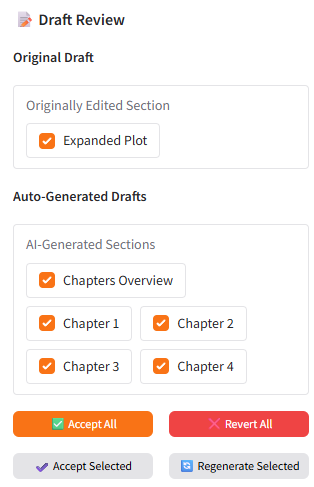

**The code in this repository is proudly and entirely written using AI**

# PlotKing - AI Story Builder

PlotKing is an interactive **AI Book Generator** that helps writers generate, validate, refine, and export novels. The application takes a short plot description and transforms it into a complete book using local LLM deployments.

## 🚀 How It Works (General Flow)

PlotKing follows a structured pipeline to ensure high-quality output:

1.  **Create**: You define the core idea, genre, and structure. The AI expands this into a detailed plot, chapter overview, and full chapters.
2.  **Edit**: You review the generated content. You can rewrite sections with AI, chat with the AI for suggestions, or manually edit text. The unique **Validation System** ensures your changes don't break the story's continuity.
3.  **Export**: Once satisfied, you export your novel to a formatted EPUB file, ready for reading or publishing.

---

## ✨ Key Features

### 1. Create: From Idea to Structure

The creation process is broken down into logical steps to maintain coherence:
-   **Plot Expansion**: Turn a short idea into a rich, multi-paragraph synopsis.
-   **Chapter Outline**: The system generates an outline of chapters based on the expanded plot.
-   **Full Generation**: Each chapter is written individually, with the AI referencing the plot and previous chapters to maintain context.
-   **Automatic Validation**: After generating a chapter, a separate AI agent reads it to ensure it matches the outline. If it fails, it auto-regenerates until it passes.

### 2. Edit: Advanced AI-Assisted Writing

The Editor tab is where the magic happens. It's not just a text box; it's a suite of tools:

#### 🛠️ Editing Modes
-   **View**: Read-only mode to browse your story.
-   **Manual**: Standard text editor for direct changes.
-   **Rewrite**: Select text and give instructions (e.g., "Make this dialogue more intense", "Describe the setting in more detail").
-   **Chat**: Converse with "Plot King" to brainstorm ideas or request changes for the current section.

#### 🛡️ Validation System & Drafts
 

When you make changes (manually or via AI), PlotKing doesn't just overwrite your work. It creates **Drafts**.
-   **Impact Analysis**: The system analyzes how your change affects future chapters.
-   **Auto-Generated Drafts**: If your change alters the plot significantly, the AI suggests updates for subsequent chapters to maintain continuity.
-   **Draft Review**: You can compare the **Checkpoint** (original) vs. **Draft** (new) using the **comparison view** ⚖️.
-   **Selective Apply**: You choose which AI suggestions to keep and which to discard or regenerate.

### 3. Export: Publish Ready

Turn your project into a finished product:
-   **EPUB Generation**: Creates a professional e-book file compatible with most readers.
-   **Metadata Fetching**: AI can suggest a title based on your story content.
-   **Customization**: Choose fonts (Georgia, Palatino, etc.) and set font sizes for the output file.
-   **Cover Art**: Upload a custom cover image to be embedded in the EPUB.

### 4. Project Management
Keep your stories organized:
-   **Save**: Persist your current progress, including plot and chapters.
-   **Load**: Switch between different story projects easily.
-   **New**: Start a fresh project from scratch.
-   **Delete**: Remove unwanted projects.

---

## Requirements

The application requires:
-   Python 3.6+
-   Gradio for the UI
-   Access to a local LLM API (default: `http://localhost:1234/v1/chat/completions`)
-   Additional dependencies listed in `requirements.txt`

## Getting Started

1.  Install dependencies: `pip install -r requirements.txt`
2.  Run the application: `python main.py` or `./run.bat` on Windows.
3.  Access the UI through your browser at `http://localhost:7860`

## Running a Local LLM with LM Studio

PlotKing is designed to work seamlessly with **local LLM deployments**, and **[LM Studio](https://lmstudio.ai/)** provides an easy way to run models locally without internet dependency.

### 🔹 Step 1: Install LM Studio
1.  Download and install LM Studio for your operating system:
    👉 [https://lmstudio.ai/](https://lmstudio.ai/)
2.  Launch LM Studio after installation.

### 🔹 Step 2: Load a Local Model
1.  Open the **Models** tab in LM Studio.
2.  Search for and download a model suitable for long context and creative writing. For local development, I'm using `gpt-oss 20b`.
3.  Once downloaded, load the model in memory.

> 💡 *Tip:* For long-form book generation, prefer models that support **at least 128K context windows**.

### 🔹 Step 3: Enable the Local Server API
1.  In LM Studio, open the **Developer** tab (top-right gear icon).
2.  Toggle **“Start Server”**.
3.  Make sure the server runs on the default address: `http://127.0.0.1:1234/v1/chat/completions`

### 🔹 Step 4: Enable FlashAttention (Optional, for Faster Generation)

If your GPU supports it (NVIDIA RTX 30xx, 40xx, or newer), you can enable **FlashAttention** for significant performance improvements, especially when working with long context windows.

In **LM Studio** while the model is loaded:

1.  Open the model's **Settings**, the gear on the left of the loaded model.
2.  Enable **“FlashAttention”**
3.  Restart the model to apply changes.

## Future Work

PlotKing is an evolving project.
Upcoming features, experimental ideas, and long-term development milestones are documented in the [Roadmap](./roadmap.md).

Check it out to see what’s planned next — from interactive editing tools and story infill/outfill features to multi-model support and visual story generation.
